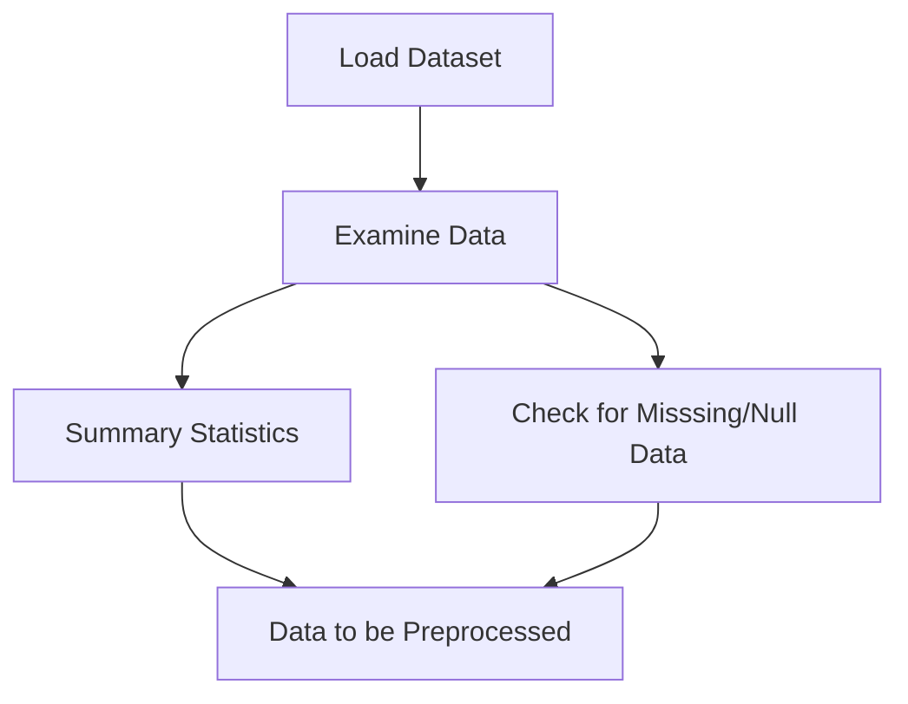
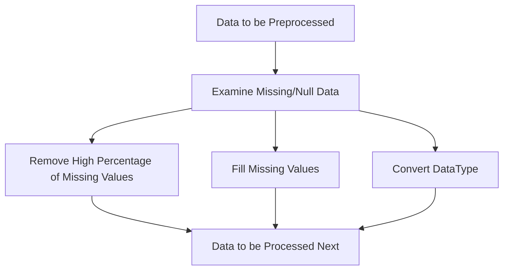
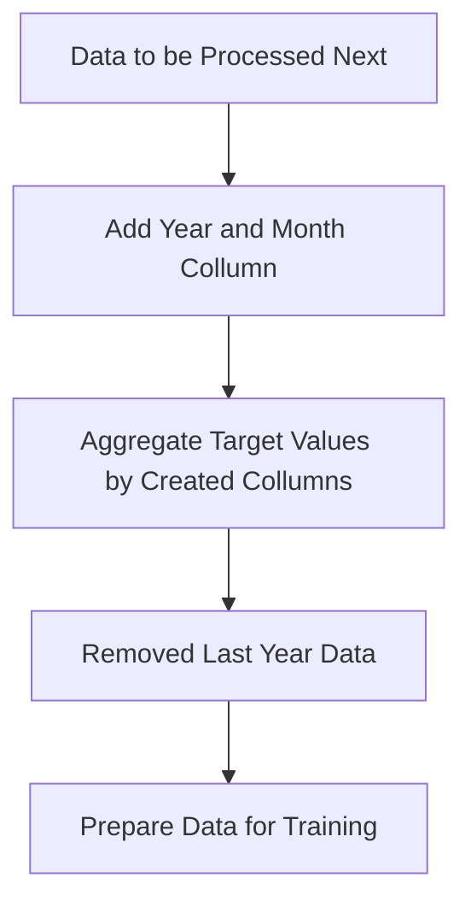
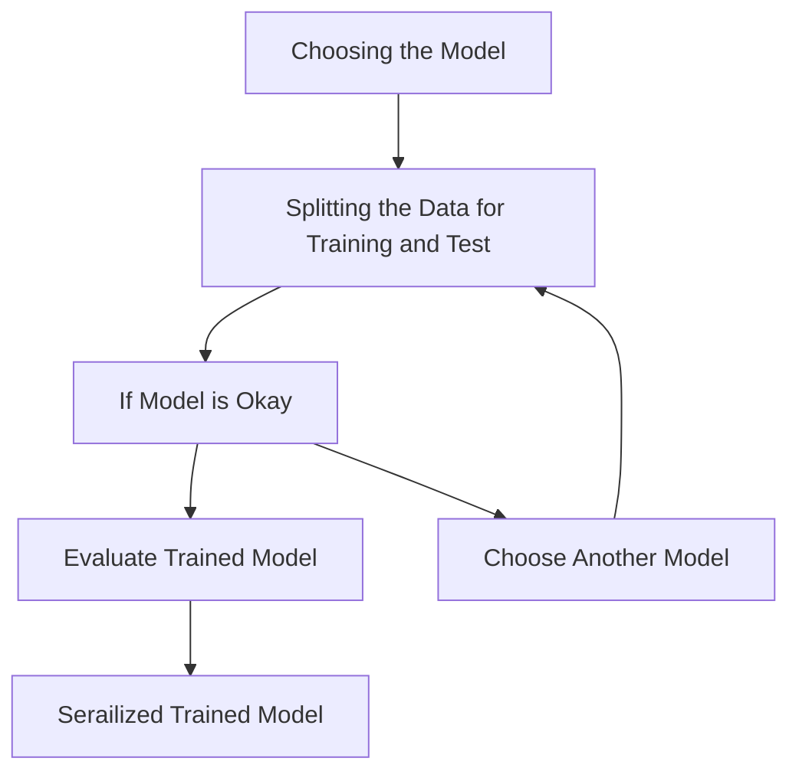

# Forecast Machine Learning Process 🛳️
---
A quick summary overview of the methods and processes in the project 🙇🙇🙇
---
## Data Preparation Process

In this process, we start by loading the data and examine for any missing or errors that we can handle in the next process:


## Data Preprocessing

Next, we would examine the missing values and determine on the handling method, as well as converting any datatype that needs to be converted:


## Feature Engineering

Now that the data is cleaned, we can start feature engineering. Here we are adding two new collumns based on the order date collumn, and as final step in this process we would also prepare the data as per what we think the model needs:


## Modelling and Evaluation

Next process would be choosing the model and then training the model based on the data that we have, here we chose to use SARIMAX after testing and examining the data. However we can keep itterating the process until we find a much better model for the data that we have:


## Format Message from the API

Example of the prediction message format that we want from the API call:
```json
{
    "prediction": "Forecast for month: 1, year: 2024 is: 1.49231219456938"
}
```

## Format Message response from API

Example of the response from the API when we do these processes:

GET: http://127.0.0.1:8000
```json
{
"status":200,"message":"It Works!"
}
```

GET: http://127.0.0.1:8000/model-status
```json
{
    "status": 200,
    "message": "The Model also works!"
}
```

POST: http://127.0.0.1:8000/predict
```json
{
    "code": 200,
    "message": "Succes",
    "prediction": "Forecast for month: 1, year: 2024 is: 1.49231219456938"
}
```

## Runthrough on retraining the model and running the API on your own local machine:
### Retrainging the model
To retrain the machine learning model, follow these steps:
- Upload the latest DataSet to data folder.
- Activate your virtualenv.
  ```bash
    conda activate virtualenv
  ```
- Navigate to the model script
  ```bash
    cd path/src/model
  ```  
- Run the python script
  ```bash
    python DemandForecastModel.py
  ```  
- The .pkl file would be updated

### Running the API
Once the model is retrained, you can run the API locally:
- Make sure the model file is in the correct location expected by the API code.
- Activate the Python environment if you haven't already.
- Navigate to the directory containing the api.py file.
  ```bash
    cd path/src/api
  ```  
- Start the FastAPI server using uvicorn. The --reload is optional.
  ```bash
    uvicorn api:app --host 0.0.0.0 --port 8000 --reload
  ```
- The API should now be running locally at http://localhost:8000.
- You can interact with the API directly using Postman or by adding /docs at the end of your host http://localhost:8000/docs.
